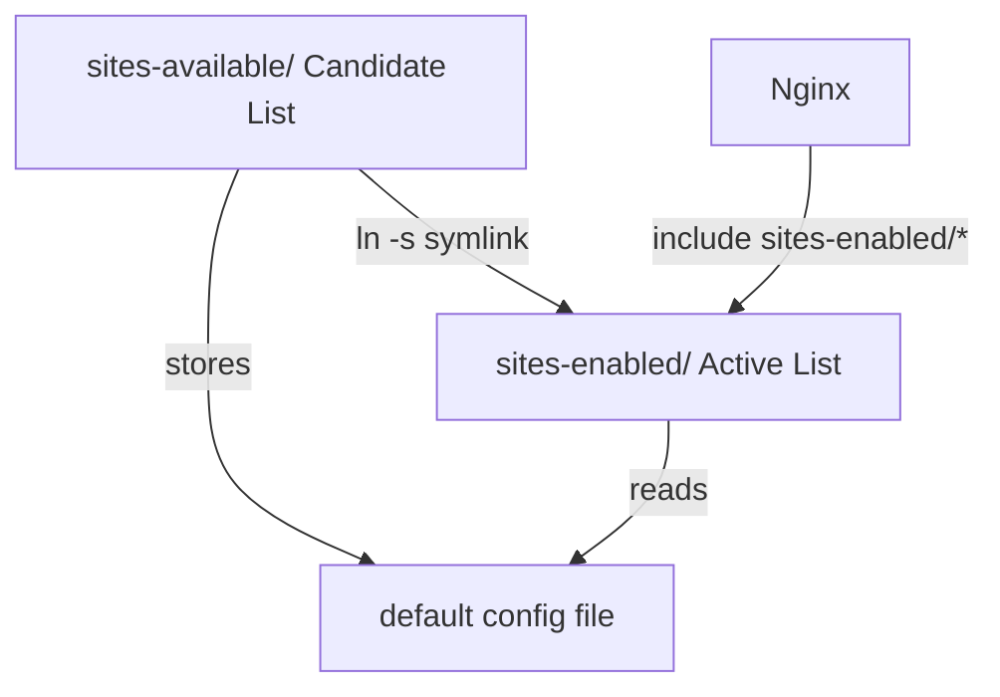

# Nginx Debugging Log: From 404 to Live — Every Pitfall I Stepped In

> A complete Nginx troubleshooting journey: from 404 to a live site, with every wrong turn documented along the way.

---

**Me**: Why is my server showing 404 Not Found?

**AI**: First, check where Nginx's `root` is currently pointing:

```bash
sudo nginx -T | grep "root"
```

| Part | Meaning |
|------|---------|
| `sudo` | Superuser DO — execute with admin privileges |
| `nginx -T` | Show the full merged configuration that Nginx has loaded |
| `\|` | Pipe — pass the output to the next command |
| `grep "root"` | Search for lines containing "root" |

Paste the output here.


---

**Me**:

```
root /var/www/html/ClickMacondo;
```

Wait — I already changed `root` to `/var/www/html/CorrofeaBlog` in `/etc/nginx/sites-available/default`. Why is it still showing ClickMacondo?

**AI**: You modified `sites-available/default`, but Nginx is not actually reading that file. Let's find the real config:

```bash
sudo nginx -T | grep -B 10 "root /var/www/html/ClickMacondo"
```

---

**Me**:

```
# configuration file /etc/nginx/conf.d/clickmacondo.conf:
server {
    listen 80;
    listen [::]:80;
    server_name _;
    root /var/www/html/ClickMacondo;
```

What does this command and output mean?

**AI**: Command breakdown:

| Part | Meaning |
|------|---------|
| `grep -B 10` | Before — show 10 lines of context before each match |

The critical clue is `# configuration file /etc/nginx/conf.d/clickmacondo.conf:` — it tells you this `root` directive comes from `/etc/nginx/conf.d/clickmacondo.conf`, not your `default` file.

**Conclusion**:

| File you modified | File actually in effect |
|------------------|------------------------|
| `/etc/nginx/sites-available/default` ❌ | `/etc/nginx/conf.d/clickmacondo.conf` ✅ |

`nginx -T` shows the merged result of all loaded configs; `-B 10` traces each directive back to its source file.

---

**Me**: clickmacondo.conf is from an old web game project. I don't want it anymore.

**AI**: Delete it:

```bash
sudo rm /etc/nginx/conf.d/clickmacondo.conf
sudo nginx -t && sudo systemctl reload nginx
```

---

**Me**: After deleting, `sudo nginx -T | grep "root"` shows nothing at all. Now the site won't load at all.

**AI**: Nginx now has no `root` directive — it doesn't know where to find your files.

The problem is that your modified `sites-available/default` was never enabled. Check what's in `sites-enabled`:

```bash
ls -la /etc/nginx/sites-enabled/
```

---

**Me**: Earlier you told me to edit `sites-available/default`. Now you're talking about `sites-enabled/default`. What's the difference? Which one is the system default?

**AI**: This is the most confusing part of Nginx. Let me explain clearly.

| Directory | Full name / meaning | Purpose |
|-----------|-------------------|---------|
| `sites-available/` | Available | Stores all site config files (the "candidate list") — NOT loaded automatically |
| `sites-enabled/` | Enabled | Stores activated site configs (the "active list") — loaded automatically by Nginx |

Here's how they work together:

```
sites-available/（candidate list）
  ├── default          ← The actual config file（you edit this）
  └── myblog.conf
        │
        │ ln -s（symlink = enable）
        ▼
sites-enabled/（active list）
  └── default -> ../sites-available/default  ← Nginx actually reads this
```

Diagram:



Ubuntu/Debian's Nginx has this line in `nginx.conf`:

```nginx
include /etc/nginx/sites-enabled/*;
```

So Nginx only reads from `sites-enabled/`.

Why symlinks instead of copying files? If you copy, changes to `sites-available/` won't sync to `sites-enabled/`. A symlink points to the same file — edit once, both paths update automatically.

---

**Me**: So what do I do now?

**AI**: Create a symlink to enable your config:

```bash
sudo ln -s /etc/nginx/sites-available/default /etc/nginx/sites-enabled/default
```

Command breakdown:

| Part | Meaning |
|------|---------|
| `ln` | Link — create a link |
| `-s` | Symbolic — create a symlink (like a Windows shortcut) |
| First path | Source file (the actual config) |
| Second path | Target (the link to create) |

Verify:

```bash
ls -la /etc/nginx/sites-enabled/
```

If you see `default -> /etc/nginx/sites-available/default` (with `l` as the first character), it worked.

Then reload:

```bash
sudo nginx -t && sudo systemctl reload nginx
```

---

**Me**: Now I'm getting 403 Forbidden.


**AI**: Progress! Going from 404 (not found) to 403 (no permission) means Nginx found the directory but can't enter it.

Check if the directory exists:

```bash
ls -la /var/www/html/
```

---

**Me**: The directory exists, but I realized my `index.html` is inside `CorrofeaBlog/public/`.

**AI**: That's it — your `root` points to `/var/www/html/CorrofeaBlog`, but the HTML files are in the `public/` subdirectory. Change `root` to:

```nginx
root /var/www/html/CorrofeaBlog/public;
```

Reload, and the site should be live.

---

## Debugging Roadmap

```
404 Not Found
  → nginx -T | grep root — locate current root
  → Found: pointing to old project ClickMacondo
  → grep -B 10 — trace config to source file
  → It's /etc/nginx/conf.d/clickmacondo.conf in effect
  → rm — delete old config
  → root vanished, 404 again
  → Learn sites-available vs sites-enabled
  → ln -s — create symlink to enable default
  → 403 Forbidden
  → ls — discover index.html is in public/ subdirectory
  → Update root to include /public
  → ✅ Live
```

## Key Takeaways

1. `nginx -T` + `grep -B 10` not only shows config content — it traces each directive back to its source file
2. Leftover config files in `conf.d/` take high priority and will silently override your changes
3. sites-available ≠ sites-enabled: one is the editing zone, the other is the activation zone, connected by symlinks
4. 404 → 403 = you're moving in the right direction: Nginx found the directory, just can't get in yet
5. The `root` path must point to the directory containing `index.html`, not the project root
