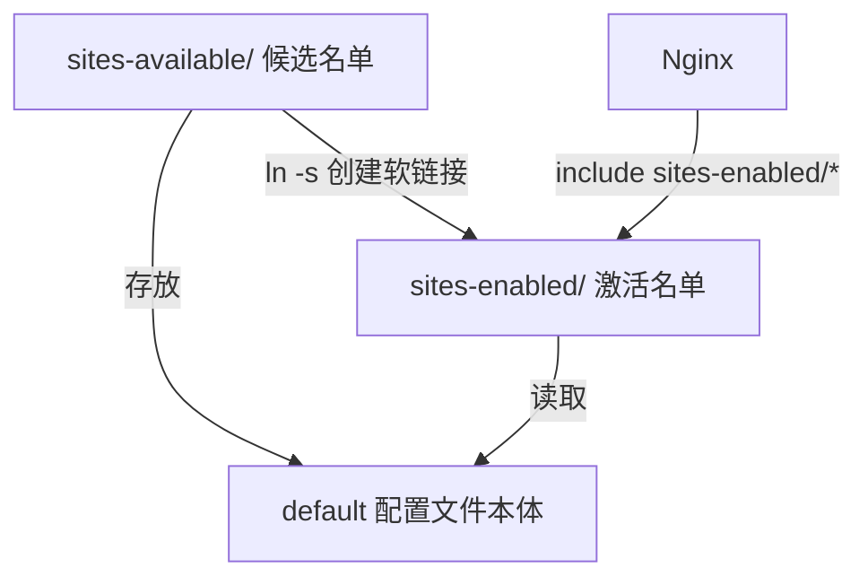

# Nginx 配置排障实录：从 404 到上线，我踩过的每一个坑

> 记录一次完整的 Nginx 故障排查：404 → 错误的配置文件 → sites-available 与 sites-enabled 之谜 → 403 → 终于找到藏在 public/ 里的 index.html。

---

**我**：为什么我的服务器网页打开是 404 Not Found？


**AI**：先确认 Nginx 当前 `root` 指向哪里：

```bash
sudo nginx -T | grep "root"
```

| 部分 | 含义 |
|------|------|
| `sudo` | Superuser DO，以管理员权限执行 |
| `nginx -T` | 显示 Nginx 当前加载的完整配置（所有启用站点的合并结果） |
| `\|` | 管道符，把前面的输出传给后面的命令 |
| `grep "root"` | 搜索包含 `root` 的行 |

把输出贴给我。

---

**我**：

```
root /var/www/html/ClickMacondo;
```

等等，我已经在 `/etc/nginx/sites-available/default` 里把 `root` 改成了 `/var/www/html/CorrofeaBlog`，为什么输出还是 ClickMacondo？

**AI**：你修改了 `sites-available/default`，但 Nginx 实际读取的不是它。来定位真正的配置文件：

```bash
sudo nginx -T | grep -B 10 "root /var/www/html/ClickMacondo"
```

---

**我**：

```
# configuration file /etc/nginx/conf.d/clickmacondo.conf:
server {
    listen 80;
    listen [::]:80;
    server_name _;
    root /var/www/html/ClickMacondo;
```

命令和输出分别是什么意思？

**AI**：命令拆解——

| 部分 | 含义 |
|------|------|
| `grep -B 10` | Before，显示匹配行前 10 行作为上下文 |
| 其余同上 | |

输出中 `# configuration file /etc/nginx/conf.d/clickmacondo.conf:` 是关键——它告诉你这行 `root` 来自 `/etc/nginx/conf.d/clickmacondo.conf`，不是你改的 `default`。

**结论**：

| 你修改的文件 | 实际生效的文件 |
|-------------|--------------|
| `/etc/nginx/sites-available/default` ❌ | `/etc/nginx/conf.d/clickmacondo.conf` ✅ |

`nginx -T` 显示的是所有被加载配置的合并结果，`-B 10` 帮你追溯每条配置来自哪个文件。

---

**我**：clickmacondo.conf 是我之前做网页游戏时用的，现在不想用它了。

**AI**：直接删：

```bash
sudo rm /etc/nginx/conf.d/clickmacondo.conf
sudo nginx -t && sudo systemctl reload nginx
```

---

**我**：删完之后 `sudo nginx -T | grep "root"` 什么都不显示了，网页也打不开了。

**AI**：Nginx 现在没有任何 `root` 指令了——它不知道去哪找文件。

问题出在你之前改的 `sites-available/default` 没有被启用。先看看 `sites-enabled` 目录里有什么：

```bash
ls -la /etc/nginx/sites-enabled/
```

---

**我**：之前不是让我找 `sites-available/default` 吗，为什么现在又是 `sites-enabled/default`？这两个到底有什么区别，哪个才是系统默认？

**AI**：这是 Nginx 最让人困惑的地方。

| 目录 | 全称 / 含义 | 作用 |
|------|-----------|------|
| `sites-available/` | Available（可用的） | 存放所有站点配置文件（候选名单），不会被自动加载 |
| `sites-enabled/` | Enabled（已启用的） | 存放被启用的站点配置（激活名单），会被自动加载 |

它们是这样配合的：

```
sites-available/（候选名单）
  ├── default          ← 配置文件本体（你编辑这个）
  └── myblog.conf
        │
        │ ln -s（创建软链接 = 启用）
        ▼
sites-enabled/（激活名单）
  └── default -> ../sites-available/default  ← Nginx 实际上读这个
```

原理图：



Ubuntu/Debian 的 Nginx 在 `nginx.conf` 中有一行：

```nginx
include /etc/nginx/sites-enabled/*;
```

所以 Nginx 只读 `sites-enabled/` 目录下的内容。

为什么用软链接而不是复制文件？如果复制，改了 `sites-available/` 中的配置后还要再复制一次。软链接自动同步——两个路径指向同一个文件。

---

**我**：所以我现在要做什么？

**AI**：创建软链接来启用你的配置：

```bash
sudo ln -s /etc/nginx/sites-available/default /etc/nginx/sites-enabled/default
```

命令拆解：

| 部分 | 含义 |
|------|------|
| `ln` | Link，创建链接 |
| `-s` | Symbolic，软链接（类似 Windows 的快捷方式） |
| 第一个路径 | 源文件（配置文件本体） |
| 第二个路径 | 目标（要创建的链接） |

验证：

```bash
ls -la /etc/nginx/sites-enabled/
```

输出中出现 `default -> /etc/nginx/sites-available/default`（首字母 `l` 表示链接）就成功了。

然后重载：

```bash
sudo nginx -t && sudo systemctl reload nginx
```

---

**我**：现在变成 403 Forbidden 了。


**AI**：进步了！从 404（找不到）到 403（没权限），说明 Nginx 已经找到目录，但进不去。

检查目录是否存在：

```bash
ls -la /var/www/html/
```

---

**我**：目录存在，但我发现我的 `index.html` 在 `CorrofeaBlog/public/` 子目录里。

**AI**：那就是了——你的 `root` 指向 `/var/www/html/CorrofeaBlog`，但 HTML 文件在 `public/` 子目录下。把 `root` 改成：

```nginx
root /var/www/html/CorrofeaBlog/public;
```

改完重载，网页正常显示。

---

## 排障路线图

```
404 Not Found
  → nginx -T | grep root 定位当前 root
  → 发现指向旧项目 ClickMacondo
  → grep -B 10 追溯配置来源
  → 是 /etc/nginx/conf.d/clickmacondo.conf 在生效
  → rm 删除旧配置
  → root 消失，再次 404
  → 了解 sites-available vs sites-enabled
  → ln -s 创建软链接启用 default
  → 403 Forbidden
  → ls 发现 index.html 在 public/ 子目录
  → 修改 root 加上 /public
  → ✅ 上线
```

## 关键教训

1. `nginx -T` + `grep -B 10` 不仅能看配置内容，还能追溯到源文件
2. `conf.d/` 目录里残留的旧配置文件优先级很高，会覆盖你后来写的配置
3. sites-available ≠ sites-enabled：前者是编辑区，后者是激活区，软链接连接二者
4. 404 → 403 = 方向对了：Nginx 找到目录但进不去，比找不到更接近成功
5. root 路径对准的是 index.html 所在目录，不是项目根目录
